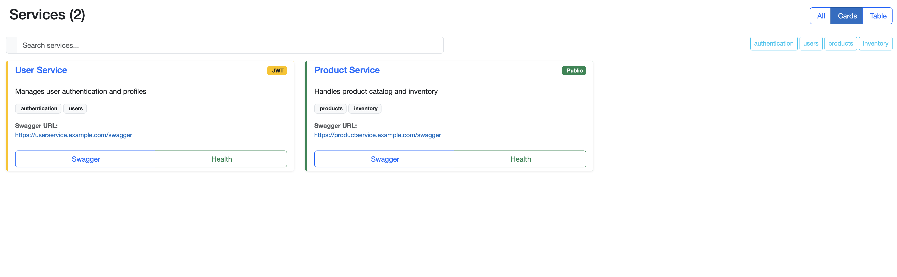

# Swaggerator



## Overview

Swaggerator is a Blazor-based web application designed to help developers work with Swagger/OpenAPI specifications. It provides an intuitive interface for viewing, editing, and validating API definitions.

## Features

- **YAML Processing**: Easily handle YAML-based OpenAPI specifications using our integrated [YamlService](./Swaggerator/Services/YamlService.cs)
- **Modern Blazor UI**: Built with Blazor WebAssembly for a responsive single-page application experience
- **Docker Support**: Containerized deployment available via the included [Dockerfile](./Swaggerator/Dockerfile)

## Getting Started

### Prerequisites

- .NET 6.0 SDK or later
- Docker (optional, for containerized deployment)

### Installation

1. Clone the repository:
   ```
   git clone https://github.com/yourusername/Swaggerator.git
   ```

2. Navigate to the project directory:
   ```
   cd Swaggerator
   ```

3. Build and run the application:
   ```
   dotnet build
   dotnet run --project Swaggerator
   ```

4. Open your browser and go to `https://localhost:5001` or the port specified in [launchSettings.json](./Swaggerator/Properties/launchSettings.json)

### Docker Deployment

Build and run using Docker:

```
docker build -t swaggerator -f Swaggerator/Dockerfile .
docker run -p 8080:80 swaggerator
```

## Project Structure

- **Pages/**: Contains Razor pages, including the [Home](./Swaggerator/Pages/Home.razor) page
- **Layout/**: Application layout components
- **Services/**: Backend services for data processing
- **wwwroot/**: Static web assets

## Contributing

Contributions are welcome! Please feel free to submit a Pull Request.

## License

This project is licensed under the MIT License - see the LICENSE file for details.